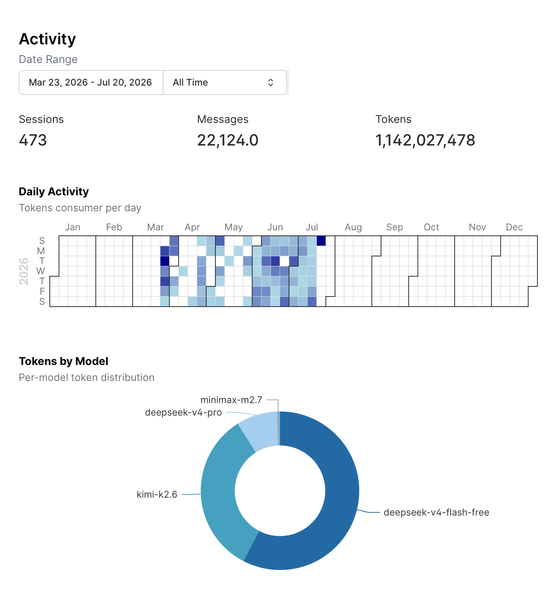
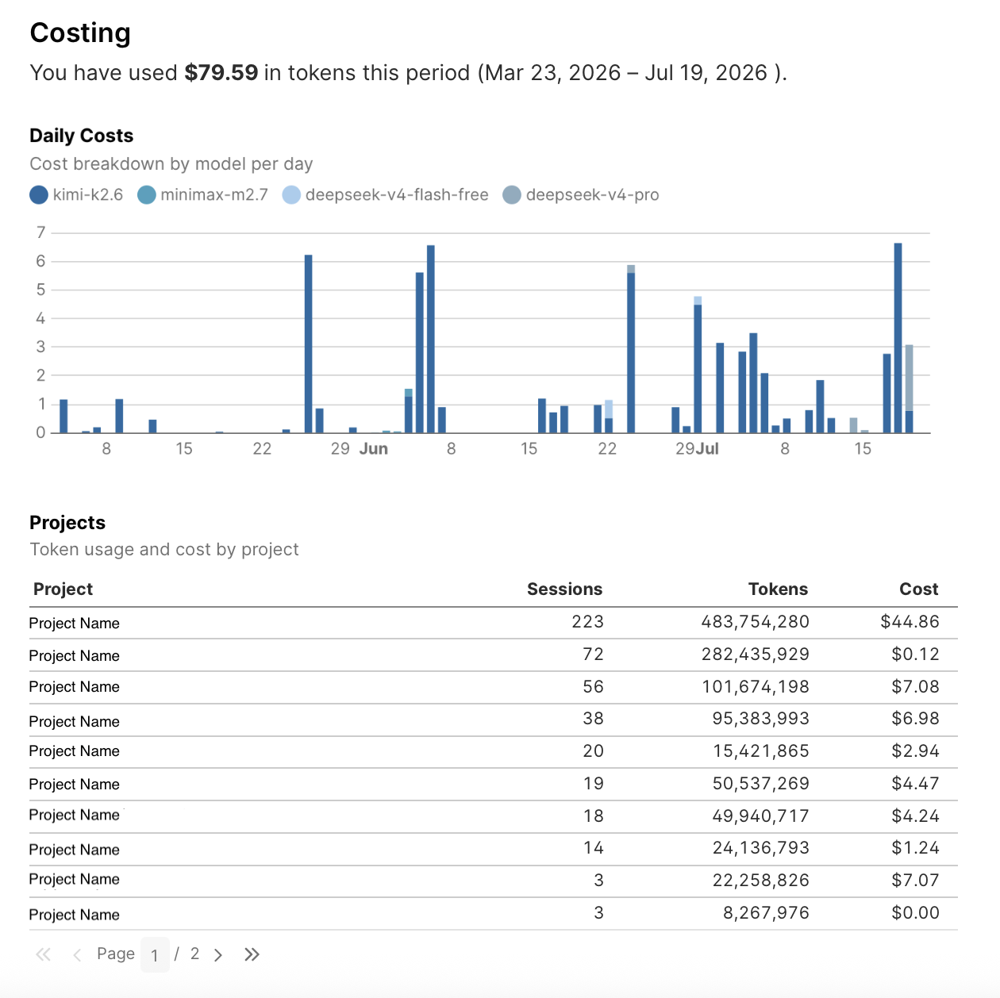

# opencode-dash

opencode-dash is a free dashboard that visualizes your [opencode](https://github.com/anomalyco/opencode) CLI usage analytics. It Visualizes sessions, tokens, costs, models, and agents, from your local SQLite database.

[](https://opensource.org/licenses/ISC)
[](https://github.com/MuhammadOmarMuhdhar/opencode-telematics/actions)
<!-- [](https://www.npmjs.com/package/opencode-dash) -->

## Quick Start

```bash
npm install
npx opencode-dash
```

Opens a local dashboard at `http://localhost:3000` showing your sessions, tokens, costs, models, and projects. The CLI auto-detects your OS (macOS, Linux, Windows) and finds your opencode database automatically.

## Features

| Feature | Description |
|---------|-------------|
| Session Analytics | Agent type, model, cost, and token usage |
| Activity Heatmap | Calendar heatmap of daily session activity |
| Model Distribution | Pie/donut chart of model usage across sessions |
| Privacy-first | No backend, no account creation needed; everything runs locally |

### Example Dashboard:

<p align="center">
  
  <br>
  <em>Activity page: sessions over time, duration distribution, longest sessions, active projects</em>
</p>

<p align="center">
  
  <br>
  <em>Cost page: input/output/reasoning token breakdown, daily cost trends, model and provider costing</em>
</p>


## How It Works
- Reads opencode's SQLite database (`~/.local/share/opencode/opencode.db` on macOS/Linux, `%LOCALAPPDATA%/opencode/opencode.db` on Windows)
- Built on [Evidence.dev](https://evidence.dev) - lightweight SQL-driven, Svelte-based reporting
- Static site output: `npm run build` produces a deployable `build/` directory
- No backend or account creation needed. So the data stays on your device.


## Contribution

### Project Structure

```
opencode-telematics/
├── bin/
│   └── cli.js                 # CLI entry point — detects OS, launches dashboard
├── app/
│   ├── pages/                 # Dashboard pages (.md)
│   │   ├── index.md           # Overview
│   │   ├── cost.md            # Token economics
│   │   ├── activity.md        # Usage over time
│   │   ├── agents.md          # Agent distribution
│   │   ├── messages.md        # Message/part analysis
│   │   ├── models.md          # Model usage
│   │   ├── projects.md        # Projects list/costing
│   │   ├── events.md          # Event types
│   │   └── quality.md         # Finish reasons, todos
│   ├── components/            # Reusable Svelte components
│   ├── sources/opencode/      # SQL queries (.sql) + connection config
│   ├── build/                 # Static site output (generated)
│   └── evidence.config.yaml
├── test/                      # E2E smoke tests
└── package.json               # Root CLI package
```

### Core Tables

These tables are created and populated automatically by opencode after each session. The CLI extracts from them to build the dashboard.

| Table | Key Columns |
|-------|-------------|
| `session` | id, project_id, parent_id, agent, model, cost, tokens_input, tokens_output, tokens_reasoning, tokens_cache_read/write, time_created |
| `message` | id, session_id, data (role, mode, finish reason), time_created |
| `part` | id, message_id, session_id, data (type, text), time_created |
| `project` | id, worktree, vcs, name |

Other tables: `todo`, `event`, `event_sequence`.

### Development Setup

```bash
git clone https://github.com/MuhammadOmarMuhdhar/opencode-dash.git
cd opencode-dash
npm install
npm run sources
npm run build
```


### Testing

| Command | Scope |
|---------|-------|
| `npm run build` | CI - builds static dashboard, catches broken SQL and layout errors | 
| `npm run test:e2e` | E2E - full npx simulation (pack → install → build → serve → page fetch) | 

CI runs `npm run build` on every push and PR.

### Local tarball test

```bash
rm -rf app/.evidence/ app/build/ app/.sources-manifest.json
npm run sources
npm run build
rm -f app/.gitignore
npm pack
npm install -g ./opencode-dash-1.0.0.tgz
opencode-dash
```

<!-- ## FAQ

**Does this send my data anywhere?** No. Everything runs locally. No backend, no account, no telemetry.

**What OS does it support?** macOS, Linux, and Windows. The CLI auto-detects your platform.

**Can I deploy it as a static site?** Yes. Run `npm run build` and serve the `app/build/` directory anywhere.

**How do I contribute?** Fork the repo, create a branch, run `npm run build` to verify, and submit a PR. -->


## License

ISC - see [LICENSE](https://opensource.org/licenses/ISC).
